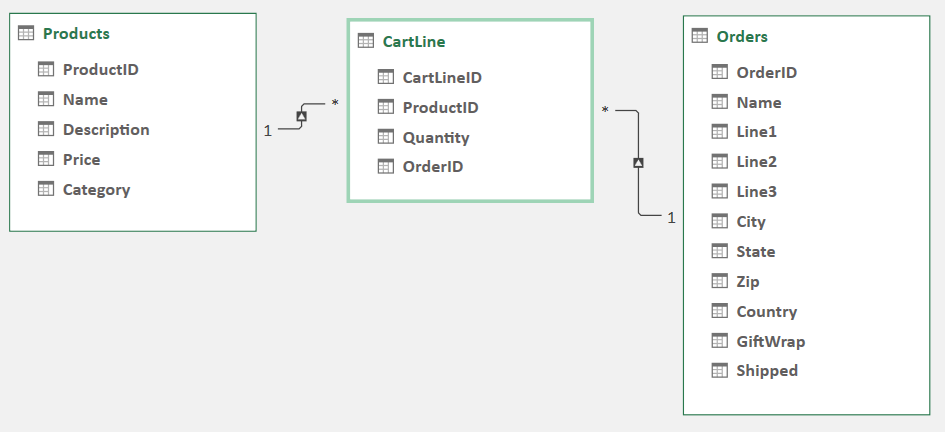

#OPIS APLIKACJI
Aplikacja s³u¿y do przegl¹dania produktów gamingowych oraz póŸniejszego ich zakupu. Umo¿liwia to centralna czêœæ strony; wszystkie produkty, z podzia³em na strony- nr stron poni¿ej produktów.Podukty mo¿na równie¿ ograniczaæ do poszczególnych kategorii za pomoc¹ panelu po lewej stronie strony. 
Poni¿ej produktów znajduje siê infomracja o mo¿liwoœci wziêcia udzia³u w turnieju (po klikniêciu w link u¿ytkownik jest przekierowany do formularza zg³oszeniowego).
Na stronie g³ównej w górnym prawym rogu znajduje siê grafika "kosza zakupowego", która prowadzi do koszyka. Je¿eli produkt znajduje siê w koszyku to obok ikony widoczna jest kwota zamówienia, oraz iloœæ umieszczonych w nim produktów.
Ka¿dy produkt, przy oznaczeniu ceny, posiada mo¿liwoœæ dodania do koszyka. Po klikniêci w przycisk "dodaj do koszyka" aplikacja przenosi u¿ytkownika automatycznie do koszyka w którym istnieje opcja wyboru "kontynuuj zakupy" lub "Z³ó¿ zamówienie". Sk³adaj¹c zamówienie u¿ytkownik uzupe³nia formularz z danymi.

#£añcuch po³¹czenia z baz¹:
Connection string z Pliku "appsettings.json
"ConnectionStrings": {
    "SklepGamingowyConnection": "Server=(localdb)\\MSSQLLocalDB;Database=SklepGamingowy;MultipleActiveResultSets=true",
    "IdentityConnection": "Server=(localdb)\\MSSQLLocalDB;Database=Identity;MultipleActiveResultSets=true"
  }

#Panel administratora jest dostêpny pod adrestem localhost:5000/admin. 
Login Admin, Has³o: $PanDa3$ 
Panel administratora umo¿liwia przegl¹d produktów oraz zamówieñ. Produkty mo¿na usuwaæ, przegl¹daæ szczegó³y, oraz za pomoc¹ formularzy edytowaæ oraz wstawiaæ nowe produkty .

Poza baz¹ danych "Identity", w projekcie wykorzystywana jest baza "SklepGamingowy"(poni¿ej diagram).

W tabeli Products przechowywane s¹ dane o produktach dostêpnych w sklepie. Tabela Orders dotyczy zamówieñ(Imiê i Nazwisko zamawiaj¹cego, Line1-3[adres]...). "CartLine" w relacji wiele-do-wielu jest tabel¹ pomostowo¹(³¹cz¹c¹).

